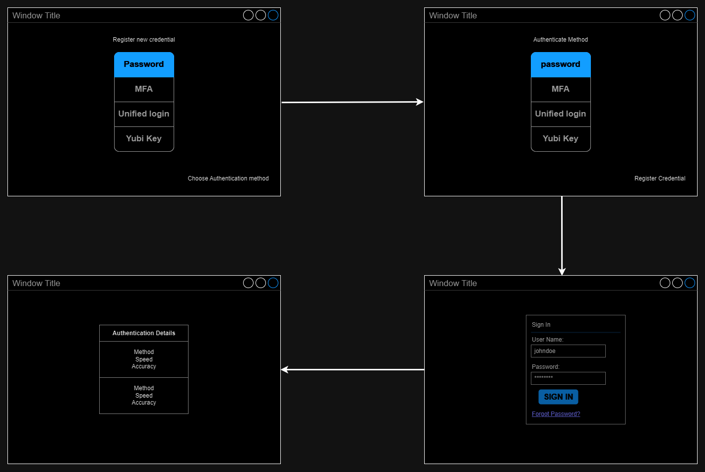
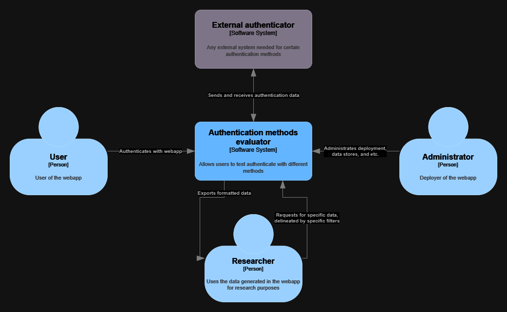
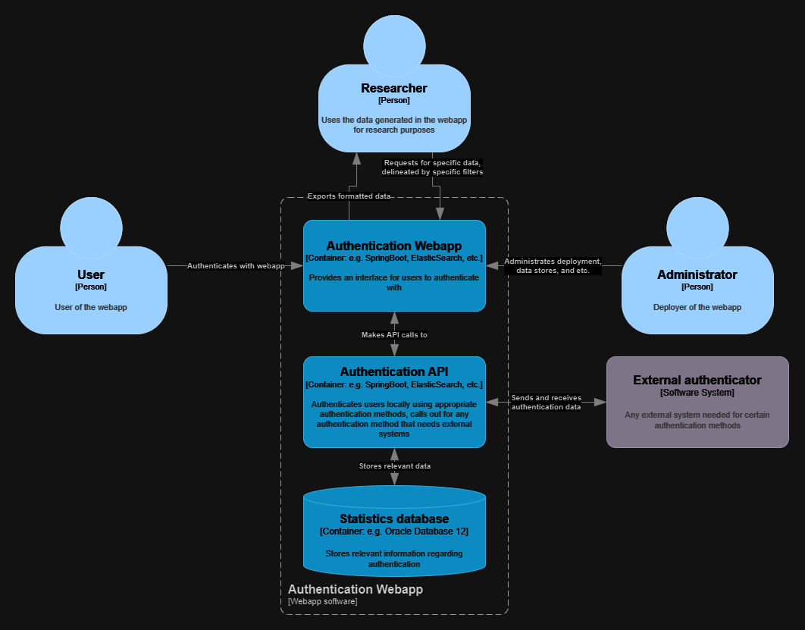
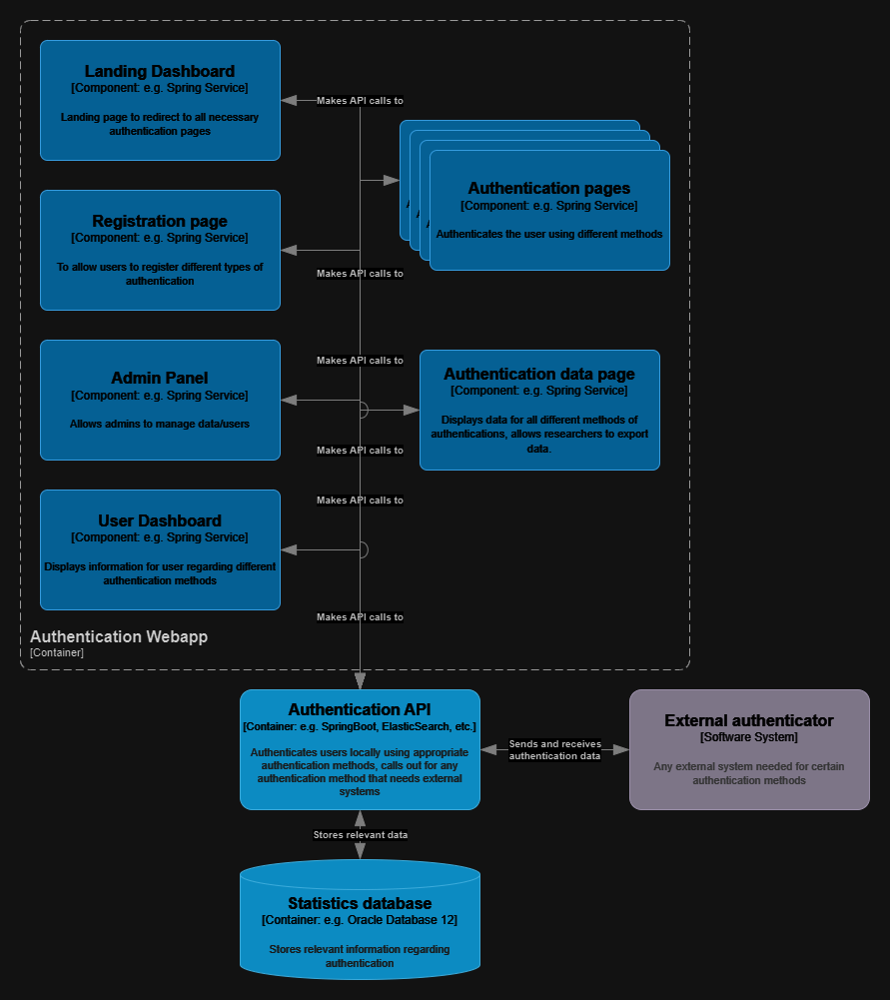

## User stories

1. As an **private user**, I want to **experiment with different authentication methods** so I can **select the most suitable authentication method for personal usage**.  
    - The webapp should include more than one authentication method so the users can compare and contrast different authentication methods.
    - The user should be able to authenticate with the available methods as many times as they desire.
    - The webapp should include authentication methods that reflex real world usage.
    - The webapp should return some quantitative information to assist in the user's decision making.

2. As a **system administrator of a deployed version of this app**, I want to **secure the authentication instances of my users** so I can **avoid the worst cast scenario**.
    - The webapp should not record authentication instances. OR Authentication instances should be secured from external access. 
    - The webapp should not authenticate to any actual system.

3. As an **academic researcher**, I want to **use this app to gather data related to user authentication UX** so I can **analyze the data and produce robust academia research**.
    - The webapp should record quantitative data across all authentication methods that can be used in statistical analysis.
    - The data recorded across authentication methods should be comparable.
    - The webapp should make this quantitative data available to researchers.
    - The webapp should format the recorded data in a readable manner.

## Mis-user stories

1. As a **malicious individual**, I want to **steal authentications** so I can **steal or sell data**.
    - There should be no authentication instances to steal, OR the authentication instances should be securely stored to prevent theft.

2. As a **uninformed user**, I will to **try to authenticate with inappropriate methods** because I don't **understand the differences**.
    - The authentication methods should provide some additional details regarding the authentication methods.
    - The authentication methods should not allow an user to authenticate using credentials meant for a different method.
    - The webapp should direct users to the correct method when credentials are entered into an inappropriate method. 

3. As a **troll**, I want to **taint the data** because it is **funny**.
    - The webapp should provide some sort of data sanitization to filter out tainted instances.
    - The webapp should not provide positive feedback to motivate an individual to continue entering tainted data.
    - The webapp should not make it clear what data is being tainted so individuals cannot target specific data groups.

## Diagrams

#### Mockup
---

#### Architecture Diagrams
---
#### C4 Top Level

---
#### C4 2nd Level

---
#### C4 3rd Level

---